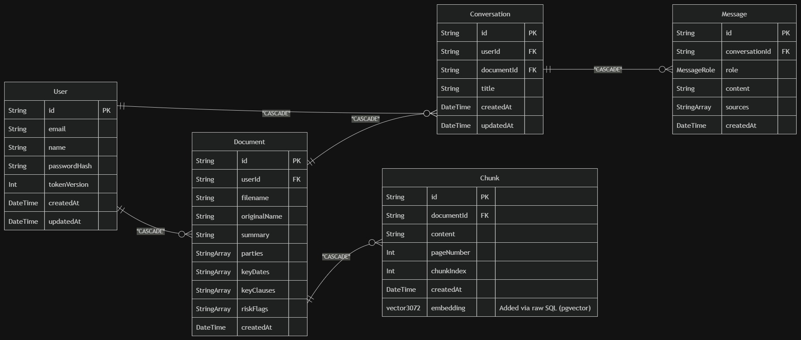

# LegalDocs AI — Smart Legal Document Intelligence Platform

A full-stack RAG-powered legal document analysis platform that enables users to upload contracts, get automatic risk analysis, and have intelligent conversations with their documents in English, Spanish, and Urdu.

**Live Demo:** [your-url-here]

---

## What it does

Upload any legal document (PDF) and the platform automatically:
- Extracts parties, key dates, clauses, and risk flags
- Enables natural language Q&A about the document
- Identifies risky clauses and suggests how to handle them
- Supports English, Spanish, and Urdu documents
- Maintains full conversation history per document

---

## Tech Stack

### Backend
| Technology | Purpose |
|---|---|
| Node.js + Express + TypeScript | REST API server |
| PostgreSQL + Prisma ORM | Relational data (users, documents, conversations) |
| pgvector extension | Vector similarity search for RAG |
| LangChain.js | PDF loading and text splitting |
| Gemini embedding-001 | Text embeddings (3072 dimensions) |
| Groq + Llama 3.1 | LLM generation and risk analysis |
| JWT + httpOnly cookies | Secure authentication |
| Multer | PDF file upload handling |
| pdfjs-dist (legacy) | Multilingual PDF text extraction |
| Neon | Hosted PostgreSQL database |

### Frontend
| Technology | Purpose |
|---|---|
| React + TypeScript + Vite | Frontend framework |
| Tailwind CSS v4 | Styling |
| React Router | Client-side routing |
| Axios | HTTP client with interceptors |
| Lucide React | Icons |
| React Markdown | Rendering AI responses |
| Context API | Global auth and theme state |

---
## ER Diagram



```
User     ──< Document     (one user has many documents)
User     ──< Conversation (one user has many conversations)
Document ──< Chunk        (one document has many chunks)
Document ──< Conversation (one document has many conversations)
Conversation ──< Message  (one conversation has many messages)
```
## Architecture
```
User uploads PDF
↓  
Express receives file via Multer
↓   
pdfjs-dist extracts text (supports English, Spanish, Urdu)
↓
LangChain RecursiveCharacterTextSplitter chunks text
(chunkSize: 2000, overlap: 100)
↓
Gemini embedding-001 converts chunks to 3072-dim vectors
(single batch API call)
↓
pgvector stores vectors in PostgreSQL Chunk table
↓
Groq/Llama generates document summary with risk flags
↓
User asks question in chat
↓
Question embedded → pgvector cosine similarity search
↓
Top 5 relevant chunks retrieved
↓
Groq generates answer with risk mitigation suggestions
↓
Answer + source citations returned to user
```

---

## Key Architectural Decisions

**Why pgvector over Pinecone?**
PostgreSQL was already running for users, documents, and conversations. Adding pgvector as an extension meant one database, one connection string, one deployment. Pinecone makes sense at massive scale  for this use case, keeping everything in one database gives transactional consistency: if a document upload fails, chunks roll back with it.

**Why Groq + Llama over Gemini for generation?**
Gemini's free tier generation quota returns `limit: 0` in Pakistan a known regional restriction. Groq provides generous free tier quota with Llama 3.1 which performs comparably for document analysis tasks. Gemini is kept for embeddings where it excels.

**Why LangChain.js over Python LangChain?**
The existing stack is MERN with TypeScript. Using LangChain.js keeps the entire backend in one language and runtime. For a production Express API, Python LangChain would require a separate microservice  unnecessary complexity at this scale.

**Why batch embeddings over individual calls?**
The initial implementation called the Gemini embeddings API once per chunk 50 chunks = 50 API calls, exhausting free tier quota immediately. Switched to `batchEmbedContents`  all chunks in one API call regardless of document size.

**Why pdfjs-dist legacy build over pdf-parse?**
`pdf-parse` works for Latin script but struggles with Arabic script encoding in Urdu PDFs. `pdfjs-dist` legacy build handles RTL text and Arabic Unicode correctly in Node.js environments. The `legacy` build is required because the standard build depends on browser APIs (`DOMMatrix`) not available in Node.js.

**Why JWT with httpOnly cookies instead of full localStorage?**
Access tokens (15 min TTL) live in localStorage for performance — they're short-lived so XSS exposure is limited. Refresh tokens (7 day TTL) live in httpOnly cookies — JavaScript cannot access them, making them immune to XSS attacks. This is the production-standard pattern used by most SaaS applications.

**Why tokenVersion for logout instead of Redis?**
Redis would require an additional service to deploy and manage. `tokenVersion` on the User table achieves the same result — incrementing it on logout invalidates all existing tokens without extra infrastructure. Redis becomes the right choice when scaling to millions of users where database lookups per request become a bottleneck.

**Why AuthRequest extends Request instead of global declaration merging?**
The standard approach of extending Express `Request` globally via `express.d.ts` failed due to TypeScript's auto-discovery limitations in this project's folder structure. `AuthRequest extends Request` is more explicit — any controller that needs `req.user` imports `AuthRequest` directly, making the dependency visible rather than implicit.

---

## Multilingual Support

The RAG pipeline is inherently language agnostic:

```
Gemini embeddings → converts meaning to math, not language
pgvector search → compares numbers, not words
Groq/Llama 3.1 → understands English, Spanish, Urdu natively
```

English and Spanish PDFs work with zero additional configuration. Urdu PDFs require `pdfjs-dist` for correct Arabic script extraction. Language detection runs on each user question and switches the system prompt language accordingly — the AI responds in whatever language the user asks in.

---

## Security

- Passwords hashed with bcrypt (cost factor 12)
- Access tokens signed with HS256, 15 minute TTL
- Refresh tokens in httpOnly cookies, 7 day TTL, inaccessible to JavaScript
- `tokenVersion` field invalidates all tokens on logout
- All document routes protected by `requireAuth` middleware
- Users can only access their own documents (userId check on every query)
- CORS restricted to frontend origin only
- File upload restricted to PDF only, 10MB limit

---

## RAG Pipeline Detail

### Ingestion (on upload)
1. PDF text extracted page by page via pdfjs-dist
2. Text split into chunks (2000 chars, 100 overlap) using RecursiveCharacterTextSplitter
3. All chunks embedded in one batch call to Gemini embedding-001
4. Chunks stored in PostgreSQL, embeddings stored in pgvector column via raw SQL
5. Document summary generated by Groq — parties, dates, clauses, risk flags extracted as structured JSON

### Retrieval (on each question)
1. User question embedded by Gemini embedding-001
2. pgvector cosine distance search (`<=>` operator) finds top 5 similar chunks
3. Chunks formatted as numbered context with source labels
4. Language-aware system prompt prepended (English/Spanish/Urdu)
5. Full prompt sent to Groq/Llama 3.1
6. Answer returned with source citations and risk mitigation suggestions
7. Conversation saved to PostgreSQL for history

---

## Project Structure

```
smart-legal-document-intelligence/
├── backend/
│ ├── prisma/
│ │ └── schema.prisma
│ └── src/
│ ├── auth/ # JWT auth — register, login, refresh, logout
│ ├── chat/ # RAG pipeline — question → answer
│ ├── conversation/ # History — sessions and messages
│ ├── document/ # Upload, ingestion, pipeline
│ │ └── pipeline/ # loader, splitter, embedder, vectorstore
│ ├── summary/ # Auto summary on upload
│ ├── config/ # env, prisma, gemini clients
│ ├── middlewares/ # auth, error, upload
│ ├── types/ # AuthRequest, ApiResponse
│ └── utils/ # jwt, response, catchAsync
└── frontend/
└── src/
├── api/ # axios config + all API calls
├── components/
│ ├── auth/ # AuthForm
│ ├── chat/ # ChatSidebar, ChatWindow, MessageBubble etc
│ ├── dashboard/ # DocumentCard, DocumentGrid, UploadZone
│ ├── layout/ # Navbar, ProtectedRoute
│ └── ui/ # Button, Input, Spinner, Badge, ThemeToggle
├── context/ # AuthContext, ThemeContext
├── hooks/ # useAuth, useDocuments, useChat
├── pages/ # Landing, Login, Register, Dashboard, Chat
└── types/ # TypeScript interfaces
```

---

## Setup

### Prerequisites
- Node.js 18+
- Neon PostgreSQL account
- Gemini API key
- Groq API key

### Installation

```bash
# clone the repo
git clone https://github.com/yourusername/smart-legal-document-intelligence
cd smart-legal-document-intelligence

# install dependencies
npm install

# setup environment variables
cp .env.example .env
# fill in your values

# enable pgvector and run migrations
# in Neon SQL Editor:
# CREATE EXTENSION IF NOT EXISTS vector;
# ALTER TABLE "Chunk" ADD COLUMN embedding vector(3072);

# push schema to database
npm run db:generate
npm run db:push

# start development server
npm run dev

# in separate terminal, start frontend
cd frontend
npm install
npm run dev
```

### Environment Variables

```bash
# .env
DATABASE_URL="postgresql://..."
JWT_ACCESS_SECRET="your_secret"
JWT_REFRESH_SECRET="your_other_secret"
GEMINI_API_KEY="your_gemini_key"
GROQ_API_KEY="your_groq_key"
PORT=5000
```

---

## API Endpoints

### Auth

```
POST /api/auth/register — create account
POST /api/auth/login — sign in
POST /api/auth/refresh — refresh access token
POST /api/auth/logout — invalidate tokens
```

### Documents

```
POST /api/documents/upload — upload and analyze PDF
GET /api/documents — get all user documents
GET /api/documents/:id — get single document
DELETE /api/documents/:id — delete document + chunks + conversations
```

### Chat
```
POST /api/chat/document/:documentId — new conversation
POST /api/chat/document/:documentId/:conversationId — continue conversation

```

### Conversations
```
GET /api/conversations — get all conversations
GET /api/conversations/:id — get conversation with messages
DELETE /api/conversations/:id — delete conversation
```

---

## Known Limitations

- Scanned/image PDFs require OCR preprocessing — text-based PDFs only
- Gemini embedding-001 free tier has daily limits — batch calls minimize usage
- Groq free tier has rate limits — suitable for development and portfolio demonstration
- Urdu PDF support depends on text encoding quality of the source document

---

## What I learned building this

- RAG pipeline architecture from ingestion to retrieval
- pgvector cosine similarity search with raw SQL in Prisma
- JWT security patterns  httpOnly cookies vs localStorage tradeoffs
- LangChain.js text splitting strategies
- TypeScript patterns  interface extension, generic API responses, catchAsync wrappers
- Production-grade error handling with global Express middleware

---

Built by Tabarak | [LinkedIn](www.linkedin.com/in/tabarakallahkhan) | [GitHub](https://github.com/TabarakAllahKhan)